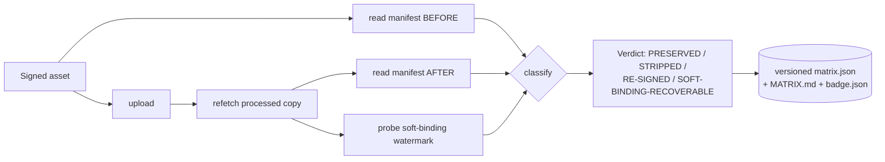

# c2pa-stripcheck

**Does platform X strip your Content Credentials? Measure it, don't guess.**

An automated tester and crowd-maintained matrix for whether platforms strip
[C2PA](https://c2pa.org/) Content Credentials on upload.

[](LICENSE)
[](https://www.python.org/)
[](tests/)
[](#development)
[](https://docs.astral.sh/uv/)
[](CONTRIBUTING.md)

> When this repo goes public, the static `tests` badge can be swapped for a live
> CI badge, and the `C2PA preserved` shield can point at the
> [shields.io endpoint](https://shields.io/badges/endpoint-badge) produced from
> `matrix/badge.json`.

---

## The problem

You sign an image with C2PA Content Credentials, upload it to a social platform,
and... does the provenance survive? Today the only answers are **scattered
manual blog anecdotes** — "I tried it back in March and it stripped everything."
There is no automated, repeatable, *versioned* record of what each platform
actually does to your credentials on upload.

`c2pa-stripcheck` packages the **measurement loop** nobody else ships: upload a
signed asset → re-fetch the platform's processed copy → classify what happened →
aggregate into a versioned, crowd-maintained matrix.

## Demo

The demo runs **fully offline** — no accounts, no network, no GPU. It drives
synthetic fixtures through a mock platform adapter that exhibits each of the four
behaviors, exercising the entire verify → classify → matrix → report pipeline:

```console
$ uv run c2pa-stripcheck run --demo --out runs/demo
Running offline demo with synthetic fixtures...
                          C2PA Content Credentials — Platform Behavior Matrix
┏━━━━━━━━━━━━━━━━━━━━━━━━┳━━━━━━━━━━━━━━━━━━━━━━━━━━━━━┳━━━━━━━━━━━━━━━━━┳━━━━━━━━━━━━━━┳━━━━━━━━━━━━━━━━━━━━━━━━┓
┃ Platform               ┃ Verdict                     ┃ Reader          ┃ Soft-binding ┃ Reason                 ┃
┡━━━━━━━━━━━━━━━━━━━━━━━━╇━━━━━━━━━━━━━━━━━━━━━━━━━━━━━╇━━━━━━━━━━━━━━━━━╇━━━━━━━━━━━━━━╇━━━━━━━━━━━━━━━━━━━━━━━━┩
│ Preserve Co (demo)     │ ✅ PRESERVED                │ builtin-scanner │ demo-wm-001  │ Same manifest signer.  │
│ StripNet (demo)        │ ❌ STRIPPED                 │ builtin-scanner │ —            │ No manifest, no soft   │
│                        │                             │                 │              │ binding.               │
│ ReSignApp (demo)       │ 🔁 RE-SIGNED                │ builtin-scanner │ —            │ Replaced by platform   │
│                        │                             │                 │              │ credentials.           │
│ SoftBind Social (demo) │ 🔗 SOFT-BINDING-RECOVERABLE │ builtin-scanner │ demo-wm-001  │ Manifest gone, TrustMark│
│                        │                             │                 │              │ watermark survived.    │
└────────────────────────┴─────────────────────────────┴─────────────────┴──────────────┴────────────────────────┘

Wrote runs/demo/matrix.json
Wrote runs/demo/MATRIX.md
Wrote runs/demo/badge.json
```

> The reason column is abbreviated above to fit; the tool prints the full reason
> at your terminal width.

Every run emits three artifacts. The real, committed outputs of the command above
live in [`assets/`](assets/):

| Artifact | What it is | Sample |
|---|---|---|
| `matrix.json` | Machine-readable matrix (schema-versioned) | [`assets/demo-matrix.json`](assets/demo-matrix.json) |
| `MATRIX.md` | Human-readable Markdown matrix | [`assets/demo-MATRIX.md`](assets/demo-MATRIX.md) |
| `badge.json` | [shields.io endpoint](https://shields.io/badges/endpoint-badge) JSON | [`assets/demo-badge.json`](assets/demo-badge.json) |

The generated `badge.json` for the demo summarizes the run as a status shield:

```json
{
  "schemaVersion": 1,
  "label": "C2PA preserved",
  "message": "1/4 preserve",
  "color": "yellow"
}
```

## What it does

For each platform, it runs a **probe**:

1. **Upload** a signed asset to the platform.
2. **Re-fetch** the platform's processed copy.
3. **Read** the Content Credentials before and after (via `c2pa-python`,
   `c2patool`, or a built-in structural scanner — whichever is available).
4. **Classify** the outcome as one of four verdicts:

   | Verdict | Meaning |
   |---|---|
   | ✅ **PRESERVED** | Manifest survived intact (same signer). |
   | ❌ **STRIPPED** | Manifest gone, nothing recoverable. |
   | 🔁 **RE-SIGNED** | Manifest replaced by the platform's own credentials. |
   | 🔗 **SOFT-BINDING-RECOVERABLE** | Embedded manifest gone, but a TrustMark watermark survives → provenance recoverable via the CAI Soft-Binding Resolution API. |

5. **Aggregate** all probes into a versioned **Markdown + JSON matrix** and a
   status **badge**.

## Install

Requires Python 3.13+ and [uv](https://docs.astral.sh/uv/).

```bash
# From source
git clone https://github.com/amanzainal/c2pa-stripcheck
cd c2pa-stripcheck
uv sync

# Or, once published, as a global tool
uv tool install c2pa-stripcheck
# or
pipx install c2pa-stripcheck
```

Optional, for cryptographic verification of real assets:

```bash
uv sync --extra verify          # installs c2pa-python
# or install the c2patool CLI from contentauth/c2pa-rs and put it on PATH
```

The tool **degrades gracefully**: with neither installed, it falls back to a
built-in structural scanner that detects manifest presence and drives the full
demo — no native dependency required.

## Usage

```bash
uv run c2pa-stripcheck run --demo --out runs/demo   # offline demo (no accounts/network/GPU)
uv run c2pa-stripcheck list                         # known platform adapters + status
uv run c2pa-stripcheck readers                      # which manifest readers are available
uv run c2pa-stripcheck matrix runs/demo/matrix.json --out runs/rerender   # re-render a saved matrix
```

`list` shows the platforms shipped with the tool and what each needs:

```console
$ uv run c2pa-stripcheck list
                         Known platform adapters
┏━━━━━━━━━━━┳━━━━━━━━━━━━━┳━━━━━━┳━━━━━━━━━━━━━━━┳━━━━━━━━━━━━━━━━━━━━━━━━━━━━━━━━━━┓
┃ Name      ┃ Display     ┃ Kind ┃ Needs account ┃ Notes                          ┃
┡━━━━━━━━━━━╇━━━━━━━━━━━━━╇━━━━━━╇━━━━━━━━━━━━━━━╇━━━━━━━━━━━━━━━━━━━━━━━━━━━━━━━━━━┩
│ instagram │ Instagram   │ stub │ yes           │ Upload via the IG Graph API... │
│ x         │ X (Twitter) │ stub │ yes           │ Upload via X API v2 media...   │
│ whatsapp  │ WhatsApp    │ stub │ yes           │ WhatsApp Cloud API...          │
│ reddit    │ Reddit      │ stub │ yes           │ Submit via the Reddit API...   │
│ tiktok    │ TikTok      │ stub │ yes           │ TikTok Content Posting API...  │
│ linkedin  │ LinkedIn    │ stub │ yes           │ LinkedIn Assets/UGC API...     │
└───────────┴─────────────┴──────┴───────────────┴────────────────────────────────┘
```

### Real platform probe (needs accounts)

```bash
cp .env.example .env                 # fill in real tokens
uv run c2pa-stripcheck run --platform instagram --asset my-signed.jpg --out runs/ig
```

Real adapters are **honest stubs** in v0 — they document the upload/re-fetch path
and the credentials each one needs, but raise `NotImplementedError` until a
contributor wires them up (or you record observed behavior by hand). A stub probe
yields an explicit `UNTESTED` verdict — **never a fabricated result**. See
[CONTRIBUTING.md](CONTRIBUTING.md).

## How it works



The classifier is **pure and deterministic** — no I/O — which is why it carries
the heaviest test coverage. Platform-specific logic lives entirely in *adapters*
(`upload` / `refetch`); the classifier, matrix, and renderers are shared, so a
correct adapter pair is all a contributor needs to add a platform.

## How this differs from existing tools

This deliberately does **not** re-implement what already exists. In particular,
re-attachment is already a solved problem — Adobe
[TrustMark](https://github.com/adobe/trustmark) (a soft-binding watermark) plus
the [CAI Soft-Binding Resolution API](https://opensource.contentauthenticity.org/)
recover provenance even after the embedded manifest is removed. This tool
*consumes* them; it does not rebuild signing or re-attachment.

| Tool | What it does | What it does *not* do |
|---|---|---|
| [`c2patool`](https://github.com/contentauth/c2patool) / [`c2pa-python`](https://github.com/contentauth/c2pa-python) | Read / verify / **sign** a single asset's manifest | No upload→re-fetch loop, no cross-platform matrix |
| [`c2pa-rs`](https://github.com/contentauth/c2pa-rs) | **Construct & sign** C2PA manifests | Not a strip-tester |
| [Adobe TrustMark](https://github.com/adobe/trustmark) + [CAI Soft-Binding API](https://opensource.contentauthenticity.org/) | **Re-attach / recover** provenance after stripping | Not a tester; this tool *consumes* them |
| [`contentauth/c2pa-attacks`](https://github.com/contentauth/c2pa-attacks) | Security / fuzzing of manifests | Not about platform strip behavior |
| [Content Credentials Verify site](https://contentcredentials.org/verify) / viewers | Inspect one asset in a browser | Manual, single-asset, not a versioned matrix |

`c2pa-stripcheck` is the only one that packages the **upload → re-fetch →
classify → versioned matrix** workflow, and treats the matrix as a
**crowd-maintained** artifact.

## Real vs. demo: what needs what

The repo is honest about what is real today and what is a documented v0 stub:

| Capability | Demo | Real run |
|---|---|---|
| Verify / classify / matrix / report logic | ✅ offline, tested | ✅ |
| Synthetic fixtures + mock adapter | ✅ | — |
| Cryptographic manifest validation | structural only | needs `c2pa-python` or `c2patool` |
| Live upload to a platform | — | needs an account + token + a wired adapter |
| Soft-binding recovery via CAI API | simulated | needs network + the CAI endpoint |

No GPU is needed for anything. The demo and the **entire test suite** run with no
network and no accounts.

## The matrix is the point

The committed [`matrix/`](matrix/) directory is the canonical, versioned record.
It ships seeded with every known platform marked `UNTESTED`. As contributors run
real probes or record observations, the matrix fills in — that crowd-maintained
record is the community value here, not any single live adapter.

## Roadmap

- [ ] Implement the first real adapter (likely Reddit or X) end-to-end.
- [ ] Wire the CAI Soft-Binding Resolution API for real recovery checks.
- [ ] Per-format rows (JPEG vs PNG vs MP4 often differ on the same platform).
- [ ] GitHub Action that regenerates the badge from `matrix/matrix.json` on merge.
- [ ] History view: track when a platform's behavior changes over time.
- [ ] Optional HTML / image matrix output.

## Development

```bash
uv run pytest -q                                        # 44 tests, fully offline
uv run --with pytest-cov pytest --cov=c2pa_stripcheck   # with coverage (~91%)
```

The suite covers verify (graceful reader fallback), the pure classifier, the
adapters, the matrix/badge serialization, the Jinja2 + Rich renderers, and the
CLI — all with no network and no accounts.

## Contributing

The matrix is crowd-maintained. You can contribute **without writing code** by
recording an observed result, or by implementing a real adapter. Either way:
synthetic fixtures only, no secrets in commits, tests stay offline. See
[CONTRIBUTING.md](CONTRIBUTING.md).

## License

MIT © Aman Zainal. See [LICENSE](LICENSE).
